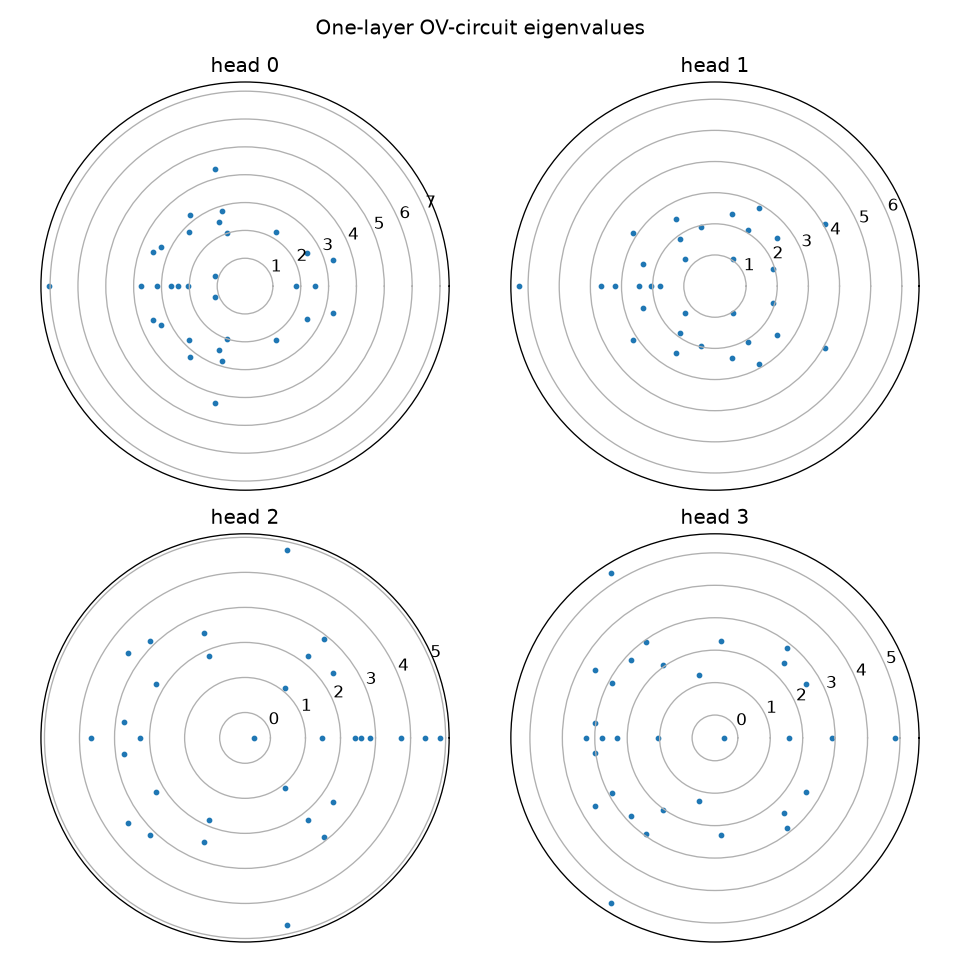
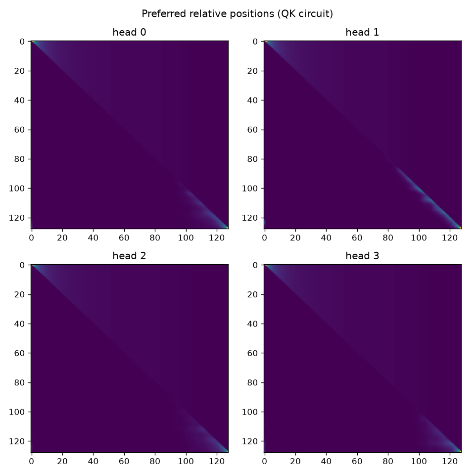
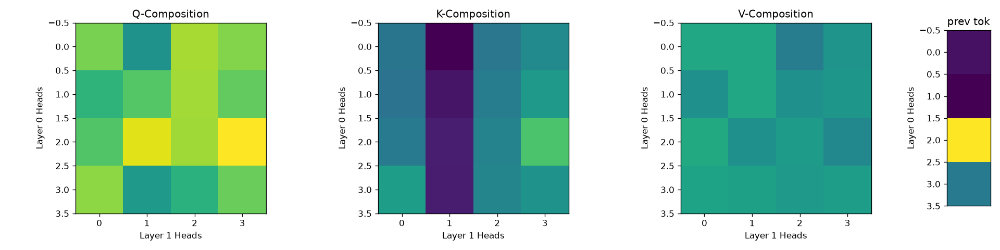
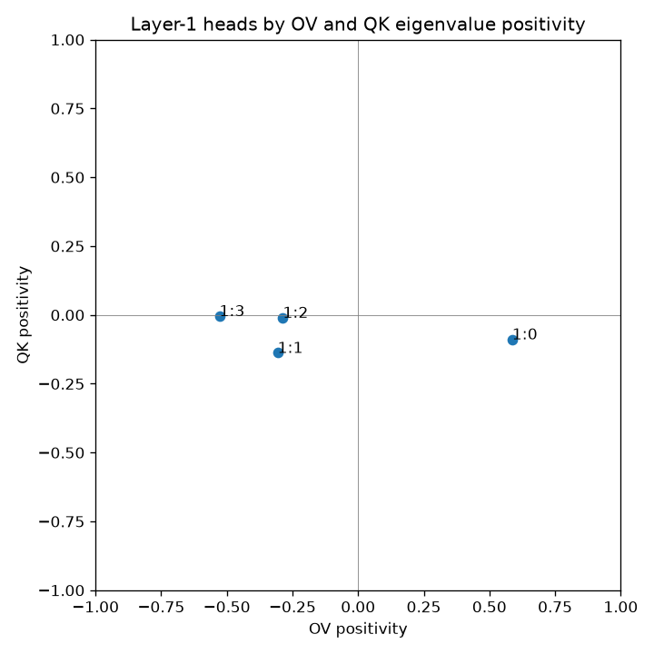

# Replica — A Mathematical Framework to Understand Transformer Circuits

Replica is a from-scratch reproduction of Anthropic's
[*A Mathematical Framework for Transformer Circuits*](https://transformer-circuits.pub/2021/framework/index.html)
(Elhage et al., 2021). It trains **attention-only** transformers (no MLP blocks)
and then reverse-engineers what their attention heads actually compute — QK and
OV circuits, positional behaviour, head composition, and induction heads — by
factoring the trained weights into interpretable matrices.

The repo is split into two halves:

- **`circuits/`** — the models and the training loop.
- **`analysis/`** — the interpretability tooling that takes a trained checkpoint
  apart head-by-head and renders the figures.

---

## Figures

These are produced by the analysis tooling below, straight from a trained
checkpoint. They live in [analysis/assets/](analysis/assets/).

| | |
| --- | --- |
|  |  |
| **OV-circuit eigenvalues** (per head, polar). Positive real eigenvalues mark "copying" heads. | **Preferred relative positions** (QK circuit) — e.g. previous-token heads. |
|  |  |
| **Q/K/V composition** between layers, plus previous-token heads — the signature of induction heads. | **Second-layer eigenvalue positivity** (OV vs QK), surfacing induction heads. |

---

## Why attention-only?

Removing the MLPs makes each layer a sum of independent attention heads whose
behaviour can be read directly off the weights. Following the framework, every
head is described by two low-rank circuits:

- **QK circuit** (`W_E^T W_Q^T W_K W_E`) — *where* a token attends.
- **OV circuit** (`W_U W_O W_V W_E`) — *what* a token writes to the residual
  stream when attended to.

For two-layer models, **composition** between a layer-0 head and a layer-1 head
(Q-, K-, and V-composition) is what gives rise to **induction heads** — heads
that implement the "repeat the token that followed the last occurrence of the
current token" rule.

---

## Repository layout

```
circuits/
  models/
    model.py              # Base Model, SinusoidalEncoding, AttentionOnlyBlock
    one_attn_layer.py     # OneLayerAttnTransformer
    two_attn_layer.py     # TwoLayerAttnTransformer
  train/
    shakespeare.py        # tiny-shakespeare data prep -> train.bin / val.bin
    trainer.py            # minGPT-style training loop (memmap data, AdamW, cosine LR)
    utils.py              # set_seed, setup_logging
    train_one_layer.py            # GPT-2-scale 1-layer config (OpenWebText)
    train_two_layer.py            # GPT-2-scale 2-layer config (OpenWebText)
    train_shakespeare.py          # small 1-layer config (CPU/MPS, minutes)
    train_two_layer_shakespeare.py# small 2-layer config (CPU/MPS, minutes)

analysis/
  utils.py                # per-head weight extraction, layernorm folding, eigenvalues
  one_layer.py            # QK/OV circuits, OV eigenvalues, positional attention
  two_layer.py            # head composition, induction heads, eigenvalue positivity
  gen_assets.py           # headless figure generation for the small checkpoint
  tests/tests.py          # checks the factored forward pass matches the real model
  assets/                 # generated figures (see below)

data/                     # generated datasets (gitignored)
out/                      # checkpoints, configs, tensorboard logs (gitignored)
```

---

## The model

Both models are built from a single `AttentionOnlyBlock`
([model.py](circuits/models/model.py)):

- `nn.MultiheadAttention` with **no bias** and a causal mask.
- **LayerNorm** before attention.
- **Sinusoidal positional encoding** added to the *query and key* but **not the
  value** stream, following
  [Shortformer](https://aclanthology.org/2021.acl-long.427.pdf). Keeping
  positions out of the value stream is what lets the OV circuit be analysed as a
  pure token→token map.
- A residual connection around the block.

A `OneLayerAttnTransformer` is `embedding → block → final LayerNorm →
unembedding`; the two-layer variant stacks two blocks. Vocabulary is GPT-2 BPE
(`tiktoken`) plus one extra **start token** (id `50257`), so `vocab_size = 50258`.

Two scales are provided:

| Config | `n_embd` | `n_head` | `block_size` | Dataset | Trains on |
| --- | --- | --- | --- | --- | --- |
| GPT-2-scale (`train_one_layer` / `train_two_layer`) | 768 | 12 | 2048 | OpenWebText | GPU |
| Small (`train_shakespeare` / `train_two_layer_shakespeare`) | 128 | 4 | 128 | tiny-shakespeare | CPU / Apple MPS in minutes |

---

## Setup

```bash
python -m venv .venv && source .venv/bin/activate
pip install -r requirements.txt
```

The code imports modules as `circuits.*` and `analysis.*`, so run everything
from the **repo root** (or put the repo root on `PYTHONPATH`). Using
`python -m` is the easiest way to get this right.

---

## Quickstart — small Shakespeare model

This is the fastest path to a trained, analysable model. It runs end-to-end on a
laptop CPU or Apple Silicon (MPS) in a few minutes.

**1. Prepare the data** (downloads tiny-shakespeare, BPE-encodes it, writes
`train.bin` / `val.bin`):

```bash
python -m circuits.train.shakespeare
```

**2. Train a one-layer model** (writes checkpoints to `out/shakespeare/`):

```bash
python -m circuits.train.train_shakespeare
```

**3. (optional) Train a two-layer model** for the composition / induction-head
analysis (writes to `out/shakespeare_2layer/`):

```bash
python -m circuits.train.train_two_layer_shakespeare
```

Both training scripts log to TensorBoard under their work dir:

```bash
tensorboard --logdir out/
```

---

## Training at GPT-2 scale (OpenWebText)

`train_one_layer.py` and `train_two_layer.py` hold the large configs (768-dim,
12-head, 2048-context) used in the paper-scale experiments. They expect a
prepared OpenWebText dataset at `data/openwebtext/{train,val}.bin` in the same
uint16 memmap format produced by [shakespeare.py](circuits/train/shakespeare.py).
The analysis scripts refer to checkpoints from these runs (e.g.
`big_drop_2_48000.pt`, `big_2layer_long_108000.pt`); these large checkpoints are
not committed.

---

## Analysis

All analysis works by **extracting the weights of each head** from a checkpoint
and folding LayerNorm into the surrounding matrices, so the QK / OV circuits can
be examined directly ([analysis/utils.py](analysis/utils.py)).

### One-layer ([analysis/one_layer.py](analysis/one_layer.py))

- **OV circuit** (`source_to_out`) — given a source token, which tokens does this
  head most increase the probability of?
- **QK circuit** (`source_to_dest`) — which tokens does a query most want to
  attend to?
- **OV eigenvalues** — positive real eigenvalues indicate "copying" heads.
- **Positional attention** — the head's preferred *relative* position (e.g. a
  previous-token head).

### Two-layer ([analysis/two_layer.py](analysis/two_layer.py))

- **Head composition** — Q-, K-, and V-composition scores between every layer-0
  and layer-1 head (Frobenius norm of the composed circuit, normalised). This is
  the signature of induction heads forming on top of previous-token heads.
- **Eigenvalue positivity** — plots layer-1 heads by OV vs QK eigenvalue
  positivity to surface induction heads.
- **Attention-on-text** — renders per-head attention over a passage
  (requires [PySvelte](https://github.com/anthropics/PySvelte)).

### Generating figures

[analysis/gen_assets.py](analysis/gen_assets.py) renders figures headlessly
(no display needed) from the small one-layer Shakespeare checkpoint at
`out/shakespeare/latest_model_2000.pt`:

```bash
python -m analysis.gen_assets
```

### Tests

[analysis/tests/tests.py](analysis/tests/tests.py) verifies that the manually
factored, head-by-head forward pass matches the real model's output — a sanity
check that the weight-extraction math is correct.

---

## Acknowledgements

- Elhage et al., [*A Mathematical Framework for Transformer Circuits*](https://transformer-circuits.pub/2021/framework/index.html) (Anthropic, 2021).
- The training loop and config style follow Andrej Karpathy's [minGPT](https://github.com/karpathy/minGPT) / [nanoGPT](https://github.com/karpathy/nanoGPT).
- Positional scheme from [Shortformer](https://aclanthology.org/2021.acl-long.427.pdf).
- Attention visualisation via [PySvelte](https://github.com/anthropics/PySvelte).
